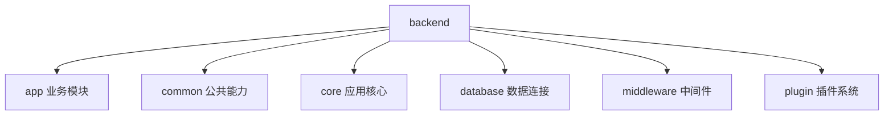

# 1. 项目总览与技术栈

## 概述

FastAPI Best Architecture 是一个面向企业场景的 FastAPI 工程化模板。它的核心价值不在“能跑起来”，而在“长期可维护”：模块边界清晰、依赖关系可控、工程能力完备。

如果你来自 Spring Boot 背景，可以把它看作 Python 语境下的“分层实践 + 工程基础设施”的组合方案。

## 项目定位

项目定位是企业级后端架构解决方案，强调以下能力：

1. 清晰的分层结构（伪三层）。
2. 统一的响应、异常、权限、日志规范。
3. 异步优先（FastAPI + SQLAlchemy Async）。
4. 可扩展能力（插件体系、缓存、可观测性）。

## 技术栈全景

| 维度 | 选型 | 版本（requirements.txt） | 作用 |
|---|---|---|---|
| Web 框架 | FastAPI | 0.135.1 | 路由、依赖注入、OpenAPI |
| 数据校验 | Pydantic v2 | 2.12.5 | 请求/响应模型、配置模型 |
| ORM | SQLAlchemy 2.0 | 2.0.48 | 模型映射、异步查询 |
| CRUD 封装 | sqlalchemy-crud-plus | 1.13.1 | 在 SQLAlchemy 基础上封装通用增删查改与动态过滤 |
| 数据库驱动 | asyncmy / asyncpg | 0.2.11 / 0.31.0 | MySQL / PostgreSQL 异步驱动 |
| 数据库迁移 | Alembic | 1.18.4 | Schema 版本管理与增量迁移 |
| 缓存 | Redis + cachebox（本地） | 7.3.0 / 5.2.2 | 鉴权状态（Redis）+ 热点数据（内存 TTLCache）|
| JWT | python-jose | 3.5.0 | Token 签发与验证 |
| 异步任务 | Celery + celery-aio-pool | 5.6.2 / 0.1.0rc8 | 定时与后台任务（支持 asyncio pool） |
| 序列化 | msgspec | 0.20.0 | 高性能 JSON 序列化（替代默认 JSONResponse）|
| 实时通信 | python-socketio | 5.16.1 | WebSocket / Socket.IO |
| 监控指标 | prometheus-client | 0.24.1 | 指标采集与 /metrics 导出 |
| 链路追踪 | opentelemetry-sdk | 1.40.0 | 分布式追踪（OTel） |
| 日志 | loguru | 0.7.3 | 结构化日志，含文件轮转 |
| ASGI 服务器 | uvicorn | 0.41.0 | 生产级 ASGI 运行时 |

## 目录结构与职责

以 backend 为核心，建议你先记住这几个目录：

1. backend/app：业务域模块（admin、task）。
2. backend/common：跨模块公共能力（异常、响应、安全、缓存等）。
3. backend/core：应用级配置与注册（conf、registrar）。
4. backend/database：数据库与 Redis 连接管理。
5. backend/middleware：请求中间件链。
6. backend/plugin：插件扩展体系。

Mermaid 结构图：



### 工程文件划分详解

以下是 `backend` 目录的实际文件结构（精简至关键文件）：

```
backend/
├── main.py                    # 进程入口：插件检查 → 依赖安装 → 注册应用
├── run.py                     # uvicorn 启动脚本
├── cli.py                     # 命令行工具（数据库管理等）
│
├── core/
│   ├── conf.py                # 全局配置（Settings 类，Pydantic Settings）
│   ├── registrar.py           # 应用注册器（register_app / register_init）
│   └── path_conf.py           # 路径常量（BASE_DIR、PLUGIN_DIR、LOG_DIR 等）
│
├── app/
│   ├── router.py              # 顶层路由聚合（admin + task）
│   ├── admin/                 # 后台管理模块
│   │   ├── api/v1/
│   │   │   ├── auth/          # 认证（login、captcha）
│   │   │   ├── sys/           # 系统管理（user、role、menu、dept、data_rule 等）
│   │   │   ├── log/           # 日志查询（login_log、opera_log）
│   │   │   └── monitor/       # 监控（server、redis、online）
│   │   ├── service/           # 业务逻辑（user_service、role_service 等）
│   │   ├── crud/              # 数据访问（crud_user、crud_role 等）
│   │   ├── model/             # ORM 模型（user、role、menu、dept、m2m 等）
│   │   └── schema/            # Pydantic 模型（user、role、token 等）
│   └── task/                  # 异步任务模块（Celery）
│
├── common/
│   ├── security/
│   │   ├── jwt.py             # Token 签发/验证，DependsJwtAuth
│   │   ├── rbac.py            # RBAC 鉴权，DependsRBAC
│   │   └── permission.py      # RequestPermission，数据权限过滤
│   ├── cache/
│   │   ├── decorator.py       # @cached / @cache_invalidate 装饰器
│   │   ├── local.py           # 本地 TTLCache（cachebox）
│   │   └── pubsub.py          # Redis Pub/Sub 多实例缓存失效广播
│   ├── exception/             # 异常层级（TokenError、AuthorizationError 等）
│   ├── response/              # 统一响应 schema 与响应码
│   ├── observability/         # OTel 初始化（otel.py）
│   └── context.py             # 请求上下文（ctx TypedDict）
│
├── database/
│   ├── db.py                  # 异步引擎、会话工厂、CurrentSession 类型别名
│   └── redis.py               # Redis 客户端封装（RedisCli）
│
├── middleware/
│   ├── access_middleware.py   # 访问日志
│   ├── jwt_auth_middleware.py # JWT 解析（Starlette AuthenticationMiddleware）
│   ├── opera_log_middleware.py# 操作日志（异步队列写入）
│   ├── i18n_middleware.py     # 国际化语言提取
│   └── state_middleware.py    # 请求状态注入
│
└── plugin/                    # 插件根目录（每个子目录为一个独立插件）
    ├── core.py                # 插件加载、路由注入、build_final_router()
    ├── config/                # 内置插件：动态配置
    ├── dict/                  # 内置插件：字典管理
    ├── email/                 # 内置插件：邮件
    ├── oauth2/                # 内置插件：OAuth2 登录
    └── code_generator/        # 内置插件：代码生成器
```

> **关键规律**：`app/admin` 是项目的"标准模块范本"，每个业务模块都应复刻它的 `api / service / crud / model / schema` 五层目录结构。

## 伪三层架构：与 Spring Boot 的映射

| Java 习惯 | 本项目分层 | 职责 |
|---|---|---|
| Controller | api | 接收请求、参数解析、返回响应 |
| DTO | schema | 数据校验、序列化 |
| Service | service | 业务规则与流程控制 |
| DAO/Mapper | crud | 数据访问封装 |
| Entity | model | 持久化对象定义 |

这套映射解决的是“职责混乱”问题。后续你看代码时要始终问自己：

1. 这段逻辑应该在哪一层？
2. 这一层是否越权访问了下一层之外的对象？

## 关键能力速览

### 1. 启动编排能力

应用通过 registrar 统一注册日志、路由、中间件、生命周期钩子。

**进程启动链路（backend/main.py）：**

```python
# 1. 检查必需插件是否已安装（缺失则直接抛出异常终止进程）
check_required_plugins()

# 2. 枚举所有插件目录，逐一安装各插件的 requirements.txt
_plugins = get_plugins()
for plugin in _plugins:
    install_requirements(plugin)   # pip install -r plugin/xxx/requirements.txt

# 3. 创建 FastAPI 应用实例，注册所有组件
app = register_app()
```

这里有一个重要设计：插件依赖安装**在进程启动时同步完成**，而不是运行期懒加载，避免服务运行中突然因缺包失败。

**register_app() 组件注册顺序（backend/core/registrar.py）：**

```python
def register_app() -> FastAPI:
    app = FastAPI(
        ...,
        default_response_class=MsgSpecJSONResponse,  # msgspec 替换默认 JSON 响应
        lifespan=register_init,                       # 绑定生命周期钩子
    )
    register_logger()          # 1. 配置 loguru 日志（必须最先，其他组件依赖日志）
    register_socket_app(app)   # 2. 挂载 Socket.IO（/ws 路径，需先于路由注册）
    register_static_file(app)  # 3. 挂载静态文件（/static、/static/upload）
    register_middleware(app)   # 4. 注册中间件链（注册顺序 ≠ 执行顺序，见下）
    register_router(app)       # 5. 注册路由（含插件路由合并）
    register_page(app)         # 6. 注册分页组件（fastapi-pagination）
    register_exception(app)    # 7. 注册全局异常处理器
    # 可选：metrics（仅 GRAFANA_METRICS_ENABLE=True 时开启）
    return app
```

**register_init lifespan 序列（应用启动/关闭时执行）：**

```python
@asynccontextmanager
async def register_init(app: FastAPI):
    # --- 启动阶段 ---
    await create_tables()                       # 1. 同步数据库表结构
    await redis_client.init()                   # 2. 建立 Redis 连接池
    await snowflake.init()                      # 3. 注册雪花算法节点 ID
    create_task(OperaLogMiddleware.consumer())  # 4. 后台操作日志消费协程
    cache_pubsub_manager.start_listener()      # 5. 启动缓存失效 Pub/Sub 监听

    yield  # 服务运行中

    # --- 关闭阶段（逆序释放）---
    await cache_pubsub_manager.stop_listener()
    await snowflake.shutdown()
    await redis_client.aclose()
```

**中间件注册与执行顺序（注册顺序与执行顺序相反）：**

```
注册顺序（代码从上到下）       实际执行顺序（请求进入时）
─────────────────────        ──────────────────────────
1. OperaLogMiddleware   →    7. CORS（最外层，最先处理跨域）
2. StateMiddleware      →    6. ContextMiddleware（注入 trace_id）
3. AuthenticationMiddleware→ 5. AccessMiddleware（记录访问日志）
4. I18nMiddleware       →    4. I18nMiddleware（提取语言标识）
5. AccessMiddleware     →    3. AuthenticationMiddleware（JWT 解析）
6. ContextMiddleware    →    2. StateMiddleware（注入请求状态）
7. CORSMiddleware       →    1. OperaLogMiddleware（最内层，记录操作日志）
```

> **为什么反序？** Starlette 的 `add_middleware` 把每个中间件包裹在前一个外层，形成洋葱结构，最后注册的反而在最外层最先执行。

### 2. 安全能力

JWT、RBAC、数据权限过滤形成完整访问控制链。

### 3. 运维友好能力

结构化日志、指标导出、链路追踪让问题可定位、可量化。

### 4. 扩展能力

插件机制支持功能模块解耦演进，不把核心代码越改越重。

## 为什么这套结构适合你

结合你的背景（Python + FastAPI 经验，Spring Boot 分层认知），这套项目的学习收益在于：

1. 把“会写接口”升级为“会设计系统”。
2. 把单体功能开发升级为跨模块协作开发。
3. 建立工程化习惯：可读、可测、可扩展、可观测。

## 学习建议

推荐先按文档顺序学习，不要一开始钻到某个 service 细节：

1. 先看启动链路，建立全局地图。
2. 再看三层架构，理解请求如何穿过各层。
3. 最后回到模块细节，理解每一层的真实职责。

## 参考文件

- ../README.zh-CN.md
- ../backend/app/router.py
- ../backend/core/registrar.py
- ../backend/main.py
