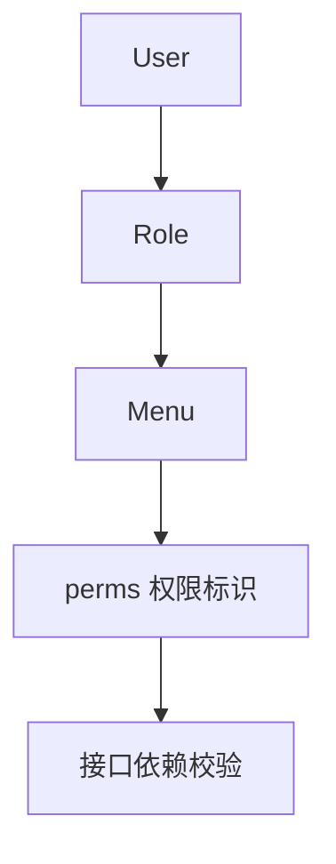

# 10. Admin 模块深度解析（下）：权限与菜单管理

## 概述

本章聚焦“角色如何获得权限”以及“菜单如何成为权限载体”。

## 菜单模型与权限标识

菜单模型位于 [backend/app/admin/model/menu.py](../backend/app/admin/model/menu.py)。

关键点：

1. perms 字段承载权限标识（如 sys:user:del）。
2. parent_id 支持树结构。
3. 菜单类型区分目录、菜单、按钮。

## 角色-菜单关系

角色与菜单是多对多关系。角色授权本质是维护 role_menu 关联表。

更新策略通常为：

1. 删除旧关联。
2. 插入新关联。

## 树形结构构建

菜单与部门都需要树形输出，常见于前端路由、侧边栏与组织架构展示。

这种结构建议统一通过工具函数构建，避免每个 service 重复写递归。

## API 层权限装配

删除用户等敏感接口会在 API 层声明依赖：

1. RequestPermission：写入权限标识。
2. DependsRBAC：执行权限验证。

这让“权限策略”在接口定义处即可见，不隐藏在业务深处。

Mermaid：

## 菜单与部门的边界校验

树结构常见错误是把节点自身设为父级，项目在 service 中做了显式防护。该类规则应放在业务层，而不是前端兜底。

## 最佳实践

1. 权限标识命名保持统一资源:动作格式。
2. 树结构相关校验统一在 service 做服务端约束。
3. 角色变更后及时清理相关缓存。

## 小结

权限体系可维护的关键，是把“角色关系、菜单结构、接口依赖”三者打通，而不是只做一张角色表。

## 参考文件

- [backend/app/admin/model/menu.py](../backend/app/admin/model/menu.py)
- [backend/app/admin/model/dept.py](../backend/app/admin/model/dept.py)
- [backend/app/admin/api/v1/sys/role.py](../backend/app/admin/api/v1/sys/role.py)
- [backend/app/admin/api/v1/sys/menu.py](../backend/app/admin/api/v1/sys/menu.py)
- [backend/common/security/rbac.py](../backend/common/security/rbac.py)
