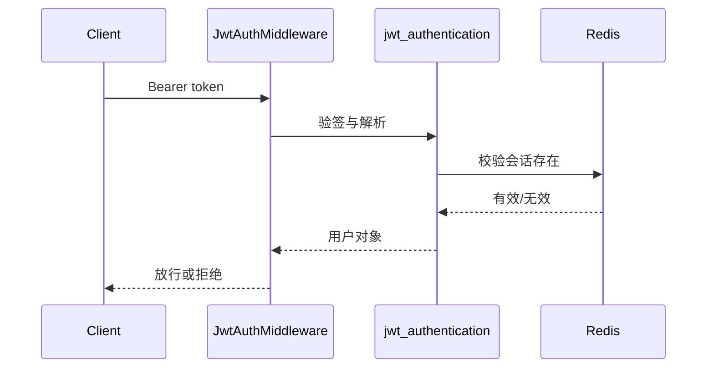

# 11. JWT 认证机制详解

## 概述

本章讲清楚项目中的认证实现：JWT 负责令牌形态，Redis 负责会话有效性。

## Token 签发

核心在 [backend/common/security/jwt.py](../backend/common/security/jwt.py) 的 `create_access_token`。

关键 payload：

1. `sub`：用户 ID（字符串形式，JWT 规范要求）。
2. `exp`：过期时间（UTC 时间戳）。
3. `session_uuid`：会话唯一标识（`uuid.uuid4()` 生成）。

`session_uuid` 的作用是让同一用户可区分多个会话，实现更精细的登出与失效控制。

完整签发实现（`create_access_token`）：

```python
async def create_access_token(user_id: int, *, multi_login: bool, **kwargs) -> AccessToken:
    expire = timezone.now() + timedelta(seconds=settings.TOKEN_EXPIRE_SECONDS)
    session_uuid = str(uuid.uuid4())  # 每次登录生成新 UUID，区分不同会话

    access_token = jwt_encode({
        'session_uuid': session_uuid,
        'exp': timezone.to_utc(expire).timestamp(),
        'sub': str(user_id),
    })

    if not multi_login:
        # 单端登录：删除该用户所有已有 token（前缀删除）
        await redis_client.delete_prefix(f'{settings.TOKEN_REDIS_PREFIX}:{user_id}')

    # 将 token 写入 Redis，键格式：{prefix}:{user_id}:{session_uuid}
    await redis_client.setex(
        f'{settings.TOKEN_REDIS_PREFIX}:{user_id}:{session_uuid}',
        settings.TOKEN_EXPIRE_SECONDS,
        access_token,
    )
    return AccessToken(access_token=access_token, ...)
```

## Redis 会话态

签发后 token 会写入 Redis。校验阶段不仅验签，还会核对 Redis 中是否存在该会话。

**Redis Key 结构：**

| 键格式 | 用途 | TTL |
|---|---|---|
| `{TOKEN_REDIS_PREFIX}:{user_id}:{session_uuid}` | Access Token | `TOKEN_EXPIRE_SECONDS`（默认配置） |
| `{TOKEN_REFRESH_REDIS_PREFIX}:{user_id}:{session_uuid}` | Refresh Token | `TOKEN_REFRESH_EXPIRE_SECONDS` |
| `{TOKEN_EXTRA_INFO_REDIS_PREFIX}:{user_id}:{session_uuid}` | Token 附加信息 | 与 Access Token 相同 |

前缀删除规则（`delete_prefix(f'{prefix}:{user_id}')`）会匹配 `{prefix}:{user_id}:*`，一次性清除该用户的所有会话，实现"踢所有端"的效果。

意义：

1. 支持主动失效（登出、改密、封禁）。
2. 支持单点/多点登录策略切换（由 `user.is_multi_login` 字段控制）。

## 认证中间件

[backend/middleware/jwt_auth_middleware.py](../backend/middleware/jwt_auth_middleware.py) 完成请求期认证：

1. 从 Authorization 提取 Bearer token。
2. 白名单路径跳过。
3. 调用 jwt_authentication 获取用户信息。
4. 注入 request.user。

Mermaid：



## 刷新与注销

项目实现了 refresh token 机制，且注销时会删除相关 Redis 键，确保会话即时失效。

**Token 刷新完整流程（`create_new_token`）：**

```python
async def create_new_token(refresh_token, session_uuid, user_id, *, multi_login, **kwargs):
    # 1. 从 Redis 取出已存储的 refresh token，验证一致性（防止伪造）
    redis_refresh_token = await redis_client.get(
        f'{settings.TOKEN_REFRESH_REDIS_PREFIX}:{user_id}:{session_uuid}'
    )
    if not redis_refresh_token or redis_refresh_token != refresh_token:
        raise errors.TokenError(msg='Refresh Token 已过期，请重新登录')

    # 2. 删除旧 refresh token 和旧 access token（旧会话作废）
    await redis_client.delete(f'{settings.TOKEN_REFRESH_REDIS_PREFIX}:{user_id}:{session_uuid}')
    await redis_client.delete(f'{settings.TOKEN_REDIS_PREFIX}:{user_id}:{session_uuid}')

    # 3. 生成新的 access token（新 session_uuid）和新 refresh token
    new_access_token = await create_access_token(user_id, multi_login=multi_login, **kwargs)
    new_refresh_token = await create_refresh_token(
        new_access_token.session_uuid, user_id, multi_login=multi_login
    )
    return NewToken(...)
```

**注销（revoke_token）：**

```python
async def revoke_token(user_id: int, session_uuid: str) -> None:
    await redis_client.delete(f'{settings.TOKEN_REDIS_PREFIX}:{user_id}:{session_uuid}')
    await redis_client.delete(f'{settings.TOKEN_EXTRA_INFO_REDIS_PREFIX}:{user_id}:{session_uuid}')
    # refresh token 由登出接口单独清理
```

刷新后旧 session_uuid 立即作废，新 token 使用新 session_uuid，防止 refresh token 被重放攻击。

## 最佳实践

1. JWT 只做“自描述令牌”，会话控制交给 Redis。
2. 改密后必须清 token 前缀键，避免旧令牌继续可用。
3. 认证失败返回语义化错误，避免泄漏敏感细节。

## 小结

这套设计把“无状态 JWT”与“可控会话态”结合起来，兼顾性能与安全。

## 参考文件

- [backend/common/security/jwt.py](../backend/common/security/jwt.py)
- [backend/middleware/jwt_auth_middleware.py](../backend/middleware/jwt_auth_middleware.py)
- [backend/database/redis.py](../backend/database/redis.py)
