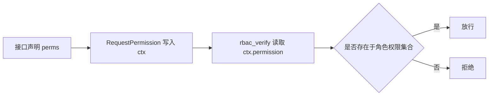

# 12. RBAC 权限系统实现

## 概述

本章解释基于角色的访问控制如何落地到接口层。

## RBAC 的数据基础

核心关系：

1. 用户拥有多个角色。
2. 角色关联多个菜单。
3. 菜单携带 perms 权限标识。

请求访问时，只要接口声明的权限标识不在用户可用权限集合内，即拒绝。

## rbac_verify 流程

核心在 [backend/common/security/rbac.py](../backend/common/security/rbac.py)。

流程：

1. 白名单路径跳过。
2. 检查认证状态。
3. 超级管理员豁免。
4. 收集启用角色权限。
5. 比对 ctx.permission。

## RequestPermission 与 RBAC 协作

在 [backend/common/security/permission.py](../backend/common/security/permission.py) 中，RequestPermission 把权限标识写入上下文。

接口示例：

```python
dependencies=[
  Depends(RequestPermission('sys:user:del')),
  DependsRBAC,
]
```

该设计实现了“接口定义即权限声明”。

Mermaid：



## 角色菜单模式与 Casbin 模式

当前项目支持角色菜单模式开关。讲解时建议强调：

1. RBAC_ROLE_MENU_MODE=true：走角色菜单校验。
2. 其他模式可切 Casbin（插件能力）。

## 最佳实践

1. 权限标识应稳定，不随前端文案变化。
2. API 依赖顺序固定：RequestPermission 在前。
3. 超级管理员豁免逻辑要保持最小化。

## 小结

RBAC 的关键不是“有角色表”，而是“请求期可执行的权限决策链”。

## 参考文件

- [backend/common/security/rbac.py](../backend/common/security/rbac.py)
- [backend/common/security/permission.py](../backend/common/security/permission.py)
- [backend/app/admin/api/v1/sys/user.py](../backend/app/admin/api/v1/sys/user.py)
