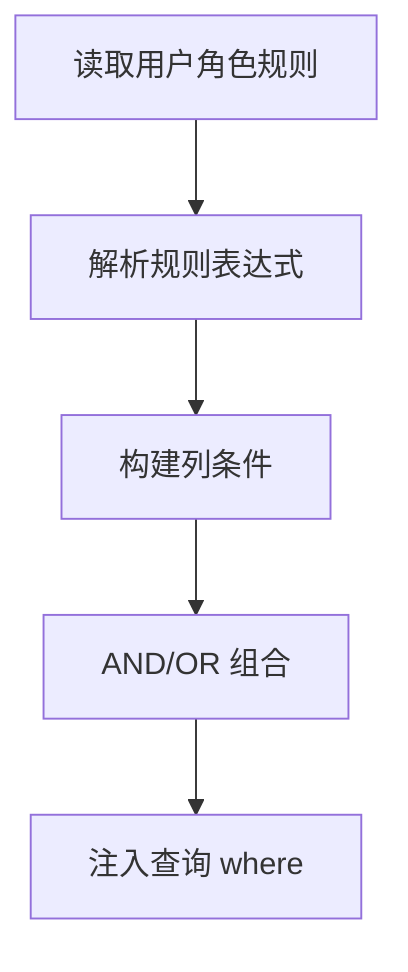

# 13. 数据权限过滤机制

## 概述

本章讲“授权后的第二道边界”：即便接口可访问，也不代表可以看所有数据。

## 数据权限的目标

典型场景：

1. 普通员工只能看本部门数据。
2. 管理角色可看更大范围。
3. 超管可看全量。

## 过滤入口

核心在 `backend/common/security/permission.py` 的 `filter_data_permission` 函数与 `DataPermissionFilter` 类。

**完整调用链（以部门列表查询为例）：**

```
API 层（dept.py）
  └─ data_filter: Annotated[ColumnElement[bool], Depends(DataPermissionFilter(Dept))]
       └─ DataPermissionFilter.__call__(request)
            └─ filter_data_permission(request, Dept)  ← 核心过滤函数
                 └─ 读取 request.user.roles → roles.scopes → scopes.rules
                      └─ 构建 SQLAlchemy WHERE 条件 → ColumnElement[bool]

Service 层（dept_service.py）
  └─ dept_dao.get_all(db, data_filter, ...)

CRUD 层（crud_dept.py）
  └─ self.select_models_order(db, 'sort', 'asc', data_filter, **filters)
       └─ SQLAlchemy 查询追加 .where(data_filter)
```

`DataPermissionFilter` 的定义（`common/security/permission.py`）：

```python
class DataPermissionFilter:
    """指定模型的数据权限过滤器，作为 FastAPI 依赖注入"""

    def __init__(self, *models: type[Model] | AliasedClass | Alias | Table) -> None:
        self.models = models  # 声明要过滤的目标模型

    async def __call__(self, request: Request) -> ColumnElement[bool]:
        return filter_data_permission(request, *self.models)
```

在 API 层使用方式：

```python
# dept.py — 注入数据权限过滤条件
@router.get('', summary='获取部门树', dependencies=[DependsJwtAuth])
async def get_dept_tree(
    db: CurrentSession,
    data_filter: Annotated[ColumnElement[bool], Depends(DataPermissionFilter(Dept))],
    name: str | None = None,
    ...
) -> ResponseSchemaModel[list[GetDeptTree]]:
    dept = await dept_service.get_tree(db=db, data_filter=data_filter, ...)
    return response_base.success(data=dept)
```

## 条件构建逻辑

流程：

1. 读取当前用户角色与数据规则。
2. 根据规则表达式组装列条件。
3. 组合 AND/OR 逻辑。
4. 返回 where 条件供查询附加。

超管直接返回全量条件。

Mermaid：



## 模板变量

规则值支持模板变量（如用户 ID、部门 ID、当前时间），让规则具备动态性而不必硬编码固定值。

项目内置的模板变量（`filter_data_permission` 中定义）：

```python
template_resolvers = {
    '${user_id}':  request.user.id,       # 当前登录用户 ID
    '${dept_id}':  request.user.dept_id,  # 当前用户所在部门 ID
    '${now}':      timezone.now,           # 当前时间
}
```

**规则配置示例**：

| 模型 | 字段 | 表达式 | 值 | 效果 |
|---|---|---|---|---|
| `Dept` | `id` | `=` | `${dept_id}` | 只返回当前用户所在部门 |
| `User` | `dept_id` | `=` | `${dept_id}` | 只返回同部门的用户 |
| `User` | `id` | `=` | `${user_id}` | 只返回当前用户自己 |

运行时，`cast_value('${dept_id}')` 会通过 `template_resolvers` 将变量替换为实际值，再转换为目标字段的 Python 类型，最终生成 `Dept.id == 42` 这样的 SQLAlchemy 条件。

## 与 CRUD/Service 的边界

建议把数据权限条件注入放在 API/Service 与查询拼接边界处，不要塞到模型定义里。

## 最佳实践

1. 数据权限默认从严：无规则即无权限。
2. 对跨表查询要明确模型映射，避免条件落错表。
3. 规则变化后注意缓存一致性。

## 小结

数据权限机制让授权从“能不能进接口”扩展到“进来后能看什么”，是企业后端不可缺失的一层。

## 参考文件

- [backend/common/security/permission.py](../backend/common/security/permission.py)
- [backend/app/admin/model/role_data_scope.py](../backend/app/admin/model/role_data_scope.py)
- [backend/app/admin/api/v1/sys/dept.py](../backend/app/admin/api/v1/sys/dept.py)
