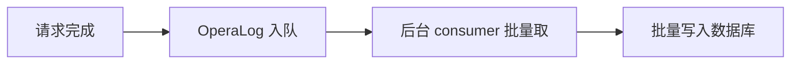

# 14. 中间件执行链与请求上下文

## 概述

本章回答：一次请求在进入业务函数之前，系统做了哪些“横切处理”。

核心包括：

1. 中间件执行顺序。
2. 上下文变量写入与读取。
3. 操作日志异步化。

## 注册顺序与执行顺序

在 [backend/core/registrar.py](../backend/core/registrar.py) 中明确写了“执行顺序从下往上”。

因此请区分：

1. 代码注册顺序。
2. 请求执行顺序（反向）。

## 中间件职责分工

关键中间件：

1. CORS：跨域。
2. Context：请求上下文容器。
3. Access：访问日志与指标。
4. I18n：语言解析。
5. JWT Auth：认证。
6. State：IP/UA 等状态信息。
7. OperaLog：操作日志采集与入队。

## 请求上下文 ctx

[backend/common/context.py](../backend/common/context.py) 的 TypedContext 提供请求级共享数据：

1. trace_id/request_id
2. user_id/permission
3. ip/country/city
4. language

这让跨层传递无需层层函数参数透传。

## 操作日志异步化

[backend/middleware/opera_log_middleware.py](../backend/middleware/opera_log_middleware.py) 采用“请求线程只入队，后台批量落库”。

收益：

1. 减少主请求写日志开销。
2. 批量写库降低 IO 次数。

Mermaid：

## 最佳实践

1. 中间件顺序视为系统契约，避免随意改动。
2. 上下文字段命名统一，防止冲突。
3. 横切能力（日志/国际化/认证）优先放中间件层。

## 小结

中间件链是业务系统的“前置控制面”，决定了可观测性、安全性与一致性。

## 参考文件

- [backend/core/registrar.py](../backend/core/registrar.py)
- [backend/common/context.py](../backend/common/context.py)
- [backend/middleware/access_middleware.py](../backend/middleware/access_middleware.py)
- [backend/middleware/i18n_middleware.py](../backend/middleware/i18n_middleware.py)
- [backend/middleware/jwt_auth_middleware.py](../backend/middleware/jwt_auth_middleware.py)
- [backend/middleware/state_middleware.py](../backend/middleware/state_middleware.py)
- [backend/middleware/opera_log_middleware.py](../backend/middleware/opera_log_middleware.py)
