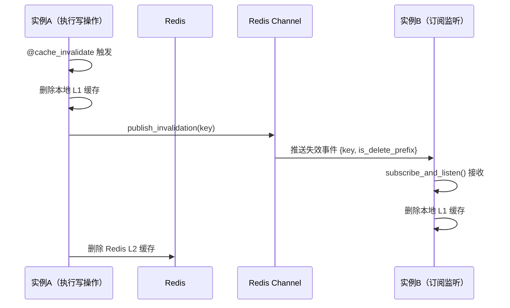

# 15. 多级缓存系统架构

## 概述

本章解释项目缓存体系：本地缓存 + Redis + Pub/Sub 失效广播。

## 双层缓存读路径

核心在 `backend/common/cache/decorator.py` 的 `@cached` 装饰器。

读取顺序：

1. 先查本地缓存（L1）。
2. 未命中再查 Redis（L2）。
3. 再未命中执行源函数并回填缓存。

**`@cached` 装饰器内部实现（精简版）：**

```python
async def wrapper(*args, **kwargs):
    cache_key = _build_cache_key(name, key, key_builder, *args, **kwargs)

    # L1：本地 TTLCache（cachebox，内存级，纳秒级延迟）
    if settings.CACHE_LOCAL_ENABLED:
        local_value = local_cache_manager.get(cache_key)
        if local_value is not None:
            return local_value  # 命中 L1，直接返回

    # L2：Redis（进程外，毫秒级延迟）
    redis_value = await redis_client.get(cache_key)
    if redis_value is not None:
        result = _deserialize_result(redis_value)
        if settings.CACHE_LOCAL_ENABLED:
            local_cache_manager.set(cache_key, result)  # 回填 L1
        return result  # 命中 L2，返回

    # 缓存未命中：执行函数并回填
    result = await func(*args, **kwargs)
    if result is not None:
        local_cache_manager.set(cache_key, result)            # 回填 L1
        await redis_client.setex(cache_key, TTL, serialized)  # 回填 L2

    return result
```

本地缓存使用 `cachebox.TTLCache`（Rust 实现），最大容量与 TTL 通过 `CACHE_LOCAL_MAXSIZE` 和 `CACHE_LOCAL_TTL` 配置。

## 写与失效

失效策略通过 `@cache_invalidate` 装饰器和 `CachePubSubManager` 实现：

1. 删除当前实例本地缓存（L1）。
2. 向 Redis Pub/Sub Channel 发布失效消息（广播给其他实例）。
3. 删除 Redis 缓存键（L2）。

其他实例的 `subscribe_and_listen()` 协程收到消息后，删除本地 L1 缓存，确保多实例一致性。

**`@cache_invalidate` 装饰器内部实现（精简版）：**

```python
async def wrapper(*args, **kwargs):
    result = await func(*args, **kwargs)  # 先执行业务操作

    invalidate_key = _build_cache_key(name, key, key_builder, *args, **kwargs)

    # 1. L1 失效（本实例）
    if settings.CACHE_LOCAL_ENABLED:
        local_cache_manager.delete(invalidate_key)  # 或 delete_prefix

    # 2. 广播失效消息（通知其他实例的 L1）
    if settings.CACHE_LOCAL_ENABLED:
        await cache_pubsub_manager.publish_invalidation(
            invalidate_key, is_delete_prefix=(invalidate_key == name)
        )

    # 3. L2 失效（Redis）
    await redis_client.delete(invalidate_key)  # 或 delete_prefix

    return result
```

**Pub/Sub 广播完整流程：**



`subscribe_and_listen()` 在应用启动时由 `cache_pubsub_manager.start_listener()` 创建为后台协程任务（`asyncio.create_task`），使用独立 Redis 连接，支持自动重连（最多 `CACHE_PUBSUB_MAX_RECONNECT_ATTEMPTS` 次）。

## 键设计

装饰器支持 `key` 或 `key_builder` 参数。推荐命名规范：

| 场景 | key 格式示例 | 说明 |
|---|---|---|
| 单对象缓存 | `user:info:{user_id}` | `name='user:info'`，`key='obj.id'` |
| 当前用户缓存 | `user:info:{user_id}` | `key_builder=user_key_builder`（从 ctx 取 user_id） |
| 列表/全量缓存 | `menu:tree` | `name='menu:tree'`，无 key（整体失效） |

`key_builder` 示例（`decorator.py` 内置）：

```python
def user_key_builder() -> str:
    """基于当前登录用户 ID 生成缓存 Key"""
    user_id = ctx.user_id
    if user_id is None:
        raise errors.ServerError(msg='用户缓存键构建失败')
    return str(user_id)
```

失效时，若 `invalidate_key == name`（没有具体 key，只有前缀），则触发前缀删除（`delete_prefix`），一次性清除该业务域所有缓存键。

## 一致性权衡

缓存系统一定要面对一致性与性能平衡：

1. 强一致越高，失效流程越复杂。
2. 性能越高，可能接受短暂旧数据窗口。

本项目倾向“明确失效 + 广播同步”的稳健策略。

## 小结

多级缓存不是简单“加 Redis”，关键在于：

1. 读路径分层。
2. 失效广播可传播。
3. 键设计可治理。

## 参考文件

- [backend/common/cache/decorator.py](../backend/common/cache/decorator.py)
- [backend/common/cache/local.py](../backend/common/cache/local.py)
- [backend/common/cache/pubsub.py](../backend/common/cache/pubsub.py)
- [backend/database/redis.py](../backend/database/redis.py)
