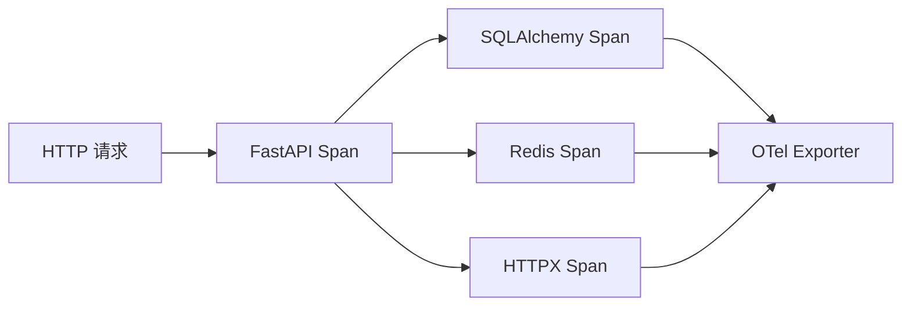

# 17. 日志系统与链路追踪

## 概述

本章聚焦可观测性的“追踪面”：如何把请求、数据库、缓存与外部调用串成一条链。

## OTel 初始化

核心在 [backend/common/observability/otel.py](../backend/common/observability/otel.py)。

主要初始化内容：

1. Resource（服务标识）。
2. TracerProvider（链路导出）。
3. MeterProvider（指标导出）。
4. LoggingProvider（日志导出）。

## 自动埋点

项目对常见组件做了自动埋点：

1. FastAPI
2. SQLAlchemy
3. Redis
4. HTTPX

这意味着你无需在每个函数手写 span，也能得到基础调用链。

## 与中间件的协同

中间件中的 trace_id/request_id 可与 OTel 数据互相补充：

1. 业务日志定位本地上下文。
2. OTel 定位跨组件调用拓扑。

Mermaid：

## 最佳实践

1. 先保证自动埋点覆盖，再补关键业务手动 span。
2. trace_id 贯穿日志与错误响应，形成闭环。
3. 观测数据命名保持稳定，避免频繁改动面板。

## 小结

链路追踪的价值在于“快速定位瓶颈和故障路径”，不是为了产生更多图表。

## 参考文件

- [backend/common/observability/otel.py](../backend/common/observability/otel.py)
- [backend/common/log.py](../backend/common/log.py)
- [backend/core/registrar.py](../backend/core/registrar.py)
