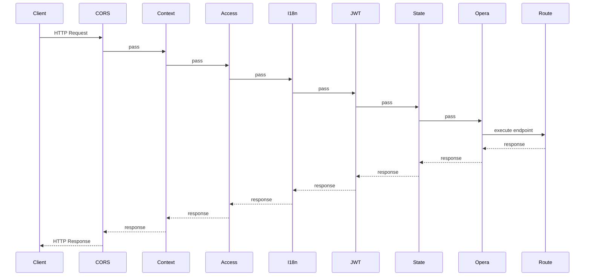

# 2. 应用启动流程深度解析

## 概述

这一章解决一个关键问题：项目从 python 启动命令到服务可用，中间到底发生了什么。

理解启动链路后，你会知道：

1. 为什么插件检查放在 main.py 里。
2. 为什么中间件顺序必须严格控制。
3. 为什么生命周期钩子是资源初始化的唯一可靠入口。

## 启动入口：main.py 做了什么

核心入口文件是 backend/main.py。它不是直接 new FastAPI，而是先完成“环境准备”，再注册应用。

关键代码片段：

```python
check_required_plugins()
_plugins = get_plugins()
for plugin in _plugins:
    install_requirements(plugin)
app = register_app()
```

这个顺序体现了一个设计原则：先确保扩展能力就绪，再构建主应用。

## register_app：应用装配中心

应用装配在 backend/core/registrar.py 的 register_app。

关键代码片段：

```python
app = FastAPI(..., default_response_class=MsgSpecJSONResponse, lifespan=register_init)
register_logger()
register_socket_app(app)
register_static_file(app)
register_middleware(app)
register_router(app)
register_page(app)
register_exception(app)
if settings.GRAFANA_METRICS_ENABLE:
    register_metrics(app)
```

这里不是“随便堆函数”，而是稳定的编排顺序：

1. 先有日志，后续阶段才能完整记录。
2. 路由在中间件注册后挂载，保证统一治理。
3. 生命周期由 lifespan 托管，确保启动和关闭成对。

## 生命周期钩子：register_init

register_init 是整个系统资源管理的主线：

启动阶段：

1. 创建数据库表。
2. 初始化 Redis 连接。
3. 初始化雪花算法节点。
4. 启动操作日志消费者后台任务。
5. 启动缓存失效监听器。

关闭阶段：

1. 停止缓存监听器。
2. 释放雪花节点。
3. 关闭 Redis 连接。

关键代码片段：

```python
@asynccontextmanager
async def register_init(app: FastAPI):
    await create_tables()
    await redis_client.init()
    await snowflake.init()
    create_task(OperaLogMiddleware.consumer())
    cache_pubsub_manager.start_listener()
    yield
    await cache_pubsub_manager.stop_listener()
    await snowflake.shutdown()
    await redis_client.aclose()
```

## 中间件注册与执行顺序

项目注释已经明确写出：执行顺序从下往上。也就是后注册的先执行。

注册顺序（代码顺序）：

1. OperaLogMiddleware
2. StateMiddleware
3. AuthenticationMiddleware(JWT)
4. I18nMiddleware
5. AccessMiddleware
6. ContextMiddleware
7. CORSMiddleware

真实执行顺序（请求进入时）：

1. CORS
2. Context
3. Access
4. I18n
5. JWT Auth
6. State
7. OperaLog
8. 路由函数

Mermaid 时序图：



## 路由注册：主路由与插件路由合并

register_router 中调用 build_final_router。这个函数来自插件系统，会把主路由和插件路由最终组合为一个路由树。

同时，项目还对路由做了两件治理工作：

1. ensure_unique_route_names
2. simplify_operation_ids

这可以减少 OpenAPI 命名冲突，提高文档可读性。

## 为什么这是“工程化启动流程”

很多项目把初始化逻辑散落在各处，导致问题定位困难。该项目把启动关注点集中在 registrar：

1. 集中装配。
2. 集中生命周期。
3. 集中可观测入口。

这就是你从“写业务”到“做系统”的关键转变。

## 常见坑与建议

1. 不要在模块 import 阶段做重量级初始化，统一放到生命周期钩子。
2. 中间件顺序不要随意调整，尤其是 Context 与认证相关中间件。
3. 新增资源连接（如 MQ、外部服务）时，必须在启动与关闭两侧对称处理。

## 小结

本章你应该掌握三件事：

1. main.py 负责启动前准备，register_app 负责应用装配。
2. lifespan 是资源生命周期管理的核心。
3. 中间件顺序是系统行为的一部分，不只是代码风格。

下一章我们进入伪三层架构，用 User 模块走完整条请求链路。

## 参考文件

- ../backend/main.py
- ../backend/core/registrar.py
- ../backend/app/router.py
