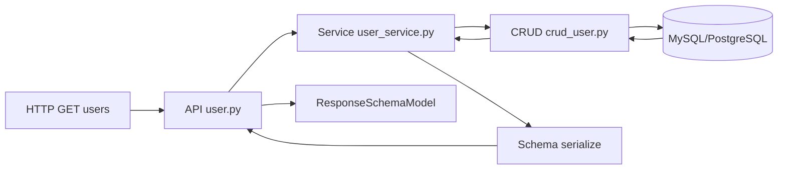

# 3. 伪三层架构设计详解

## 概述

这一章用一个真实业务链路回答两个问题：

1. 为什么这个项目称为伪三层架构。
2. 在 FastAPI 中，分层如何真正落地，而不是只停留在目录命名。

我们以用户模块为主线，串起 model → crud → service → api。

## 什么是“伪三层”

在 Python Web 生态中，三层架构并没有统一标准实现。该项目称为“伪三层”，强调的是分层思想而非框架强约束。

对应关系如下：

| 角色 | 本项目目录 | 说明 |
|---|---|---|
| Controller | api | 请求入口与参数声明 |
| DTO | schema | 请求与响应结构 |
| Service | service | 业务规则编排 |
| DAO | crud | 数据访问细节 |
| Entity | model | ORM 模型定义 |
### admin 模块真实文件结构

`app/admin` 是项目中最完整的业务模块，也是你新建模块时的参照范本。它的完整文件布局如下：

```
app/admin/
├── api/
│   ├── router.py              # admin 模块顶层路由（prefix = /api/v1）
│   └── v1/
│       ├── auth/
│       │   ├── auth.py        # 登录、登出、刷新 Token
│       │   └── captcha.py     # 验证码
│       ├── sys/
│       │   ├── user.py        # 用户管理接口
│       │   ├── role.py        # 角色管理接口
│       │   ├── menu.py        # 菜单管理接口
│       │   ├── dept.py        # 部门管理接口
│       │   ├── data_rule.py   # 数据规则接口
│       │   ├── data_scope.py  # 数据范围接口
│       │   ├── file.py        # 文件上传接口
│       │   └── plugin.py      # 插件管理接口
│       ├── log/
│       │   ├── login_log.py   # 登录日志
│       │   └── opera_log.py   # 操作日志
│       └── monitor/
│           ├── server.py      # 服务器状态
│           ├── redis.py       # Redis 状态
│           └── online.py      # 在线用户
│
├── service/
│   ├── auth_service.py        # 登录鉴权业务
│   ├── user_service.py        # 用户业务
│   ├── role_service.py        # 角色业务
│   ├── menu_service.py        # 菜单业务
│   ├── dept_service.py        # 部门业务
│   ├── data_rule_service.py   # 数据规则业务
│   ├── data_scope_service.py  # 数据范围业务
│   ├── login_log_service.py   # 登录日志业务
│   ├── opera_log_service.py   # 操作日志业务
│   └── plugin_service.py      # 插件管理业务
│
├── crud/
│   ├── crud_user.py           # 用户 CRUD
│   ├── crud_role.py           # 角色 CRUD
│   ├── crud_menu.py           # 菜单 CRUD
│   ├── crud_dept.py           # 部门 CRUD
│   ├── crud_data_rule.py      # 数据规则 CRUD
│   ├── crud_data_scope.py     # 数据范围 CRUD
│   ├── crud_login_log.py      # 登录日志 CRUD
│   └── crud_opera_log.py      # 操作日志 CRUD
│
├── model/
│   ├── user.py                # User ORM 模型（sys_user 表）
│   ├── role.py                # Role ORM 模型（sys_role 表）
│   ├── menu.py                # Menu ORM 模型（sys_menu 表）
│   ├── dept.py                # Dept ORM 模型（sys_dept 表）
│   ├── data_rule.py           # DataRule ORM 模型
│   ├── data_scope.py          # DataScope ORM 模型
│   ├── m2m.py                 # 多对多关联表（user_role、role_menu、role_data_scope 等）
│   ├── login_log.py           # 登录日志模型
│   └── opera_log.py           # 操作日志模型
│
└── schema/
    ├── user.py                # 用户输入/输出 Schema
    ├── role.py                # 角色 Schema
    ├── menu.py                # 菜单 Schema
    ├── dept.py                # 部门 Schema
    ├── token.py               # Token Schema
    ├── data_rule.py           # 数据规则 Schema
    ├── data_scope.py          # 数据范围 Schema
    ├── captcha.py             # 验证码 Schema
    └── monitor.py             # 监控 Schema
```

> **规律**：一个 CRUD 文件对应一个 model 文件，一个 service 文件整合该实体的业务规则，一个 api 文件暴露该实体的 HTTP 接口。schema 层横跨请求和响应，可能对应多个不同视图（AddXxxParam、UpdateXxxParam、GetXxxDetail）。
## 五层职责边界

### model 层

定义数据库实体，不写业务流程。

示例（backend/app/admin/model/user.py）：

```python
class User(Base):
    __tablename__ = 'sys_user'
    id: Mapped[id_key] = mapped_column(init=False)
    username: Mapped[str] = mapped_column(sa.String(64), unique=True, index=True)
    status: Mapped[int] = mapped_column(default=1, index=True)
    dept_id: Mapped[int | None] = mapped_column(sa.BigInteger, default=None)
```

### crud 层

专注数据访问：查询、更新、关联处理。

示例（backend/app/admin/crud/crud_user.py）：

```python
async def get_select(self, dept, username, phone, status) -> Select:
    filters = {}
    if username:
        filters['username__like'] = f'%{username}%'
    return await self.select_order(
        'id',
        'desc',
        join_conditions=[
            JoinConfig(model=Dept, join_on=Dept.id == self.model.dept_id, fill_result=True),
            JoinConfig(model=user_role, join_on=user_role.c.user_id == self.model.id),
            JoinConfig(model=Role, join_on=Role.id == user_role.c.role_id, fill_result=True),
        ],
        **filters,
    )
```

### service 层

编排业务规则，不暴露数据库细节给 API。

示例（backend/app/admin/service/user_service.py）：

```python
async def create(*, db: AsyncSession, obj: AddUserParam) -> None:
    if await user_dao.get_by_username(db, obj.username):
        raise errors.ConflictError(msg='用户名已注册')
    if not await dept_dao.get(db, obj.dept_id):
        raise errors.NotFoundError(msg='部门不存在')
    await user_dao.add(db, obj)
```

### api 层


负责 HTTP 协议适配与依赖装配。

示例（backend/app/admin/api/v1/sys/user.py）：

```python
@router.get('', dependencies=[DependsJwtAuth, DependsPagination])
async def get_users_paginated(db: CurrentSession, dept: int | None = None):
    page_data = await user_service.get_list(db=db, dept=dept, username=None, phone=None, status=None)
    return response_base.success(data=page_data)
```
> /v1/ 是 API 版本管理的行业标准，保证接口演进时老客户端不崩溃，是生产级项目的必备设计。

### schema 层

保证输入输出结构稳定、可验证。

示例（backend/app/admin/schema/user.py）：

```python
class AddUserParam(AuthSchemaBase):
    nickname: str | None
    email: CustomEmailStr | None    # 自定义邮箱类型，允许 None 不报错
    phone: CustomPhoneNumber | None # 正则约束：^1[3-9]\d{9}$
    dept_id: int
    roles: list[int]
```

`CustomEmailStr` 和 `CustomPhoneNumber` 的定义位于 `backend/common/schema.py`：

```python
# 手机号：Annotated 类型，直接用正则约束，不需要额外校验器
CustomPhoneNumber = Annotated[str, Field(pattern=r'^1[3-9]\d{9}$')]

# 邮箱：继承 Pydantic 的 EmailStr，重写 _validate 使空字符串返回 None 而非报错
class CustomEmailStr(EmailStr):
    @classmethod
    def _validate(cls, input_value: str, /) -> str:
        return None if not input_value else validate_email(input_value)[1]
```

> **为什么不用裸 `str`？** 使用自定义类型有两个好处：1. Pydantic 在反序列化阶段自动校验，业务代码无需手动正则检查；2. OpenAPI schema 中会自动生成带格式约束的文档字段（`format: email`、`pattern` 字段），前端可直接参考。

## 一条请求如何穿过三层

以“分页获取用户列表”为例：

1. API 接收 query 参数与依赖注入的数据库会话。
2. Service 调用 CRUD 生成查询表达式并执行分页。
3. CRUD 使用 JoinConfig 拼接部门与角色关联。
4. Service 对关联结果做序列化整理。
5. API 返回统一响应结构。

Mermaid 流程图：



### 路由聚合机制

路由是分层汇聚的，从具体接口文件一路向上合并到 FastAPI 应用实例。完整链路：

```
api/v1/sys/user.py       → router = APIRouter()          prefix 由 sys/__init__.py 指定
api/v1/sys/__init__.py   → router  prefix='/sys'，include 所有 sys 子路由
api/v1/auth/__init__.py  → router  prefix='/auth'
app/admin/api/router.py  → v1 = APIRouter(prefix='/api/v1')，include auth/sys/log/monitor
app/router.py            → router 聚合 admin_v1 + task_v1
plugin/core.py           → build_final_router() 注入插件路由后返回最终 router
registrar.py             → app.include_router(router) 注册进 FastAPI
```

`build_final_router()` 关键实现（`backend/plugin/core.py`）：

```python
def build_final_router() -> APIRouter:
    extend_plugins, app_plugins = parse_plugin_config()

    # 1. 扩展级插件先注入（在主路由导入前完成，避免错过模块缓存窗口）
    for plugin in extend_plugins:
        inject_extend_router(plugin)

    # 2. 导入主路由（此时扩展级插件已注入）
    from backend.app.router import router as main_router

    # 3. 应用级插件追加新路由到主路由
    for plugin in app_plugins:
        inject_app_router(plugin, main_router)

    return main_router
```

> **两类插件路由的区别**：扩展级插件（extend）修改已有路由，必须在主路由模块导入前注入；应用级插件（app）作为新路由追加，顺序相对灵活。

## 事务边界在哪里

项目通过依赖区分两类会话：

1. `CurrentSession`：一般查询场景（`autocommit=False`，不自动开事务）。
2. `CurrentSessionTransaction`：写操作场景（`session.begin()` 自动开事务，异常时自动回滚）。

两者的实际定义在 `backend/database/db.py`：

```python
async def get_db() -> AsyncGenerator[AsyncSession, None]:
    """获取数据库会话（查询场景）"""
    async with async_db_session() as session:
        yield session

async def get_db_transaction() -> AsyncGenerator[AsyncSession, None]:
    """获取带有事务的数据库会话（写操作场景）"""
    async with async_db_session.begin() as session:
        yield session   # 退出时自动 commit，异常时自动 rollback

# FastAPI 依赖注入的类型别名（在 API 函数参数中直接使用）
CurrentSession = Annotated[AsyncSession, Depends(get_db)]
CurrentSessionTransaction = Annotated[AsyncSession, Depends(get_db_transaction)]
```

在 API 层使用方式：

```python
# 查询接口：用 CurrentSession
async def get_users(db: CurrentSession, ...):
    ...

# 写操作接口：用 CurrentSessionTransaction
async def create_user(db: CurrentSessionTransaction, ...):
    # 在 service 中调用 db.flush() 而非 db.commit()
    # 事务由 get_db_transaction 的 async_db_session.begin() 管理
    ...
```

例如创建用户接口使用 `CurrentSessionTransaction`，保障"用户表写入 + 用户角色关联写入"在同一事务中，任何步骤失败整个操作回滚。

## 权限边界在哪里

API 层通过依赖组合实现权限边界，而不是把权限判断写进业务函数。

示例：

```python
dependencies=[
    Depends(RequestPermission('sys:user:del')),
    DependsRBAC,
]
```

这样做的好处是：

1. 权限逻辑可复用。
2. Service 保持业务纯度。
3. 接口权限策略一眼可见。

### 三个权限依赖的定义位置与执行时序

| 依赖 | 定义文件 | 作用 |
|---|---|---|
| `DependsJwtAuth` | `common/security/jwt.py` | 提取 Bearer Token，驱动 JwtAuthMiddleware 完成身份解析 |
| `RequestPermission('xxx')` | `common/security/permission.py` | 将接口的权限标识（如 `sys:user:del`）写入请求上下文 |
| `DependsRBAC` | `common/security/rbac.py` | 读取上下文中的权限标识，与用户角色的菜单权限列表做匹配 |

**执行顺序**（FastAPI 依赖注入按声明顺序执行）：

```
DependsJwtAuth → Depends(RequestPermission('xxx')) → DependsRBAC
     ↓                        ↓                            ↓
  验证 Token            将权限标识存入 ctx.permission    从 ctx.permission
  解析用户信息          （必须在 DependsRBAC 之前）       取出并校验用户角色
```

`RequestPermission` 的核心实现（`common/security/permission.py`）：

```python
class RequestPermission:
    def __init__(self, value: str) -> None:
        self.value = value  # 权限标识，如 'sys:user:del'

    async def __call__(self, request: Request) -> None:
        if settings.RBAC_ROLE_MENU_MODE:
            ctx.permission = self.value  # 注入到请求上下文
```

`DependsRBAC` 的核心逻辑（`common/security/rbac.py`）：

```python
async def rbac_verify(request: Request, _token: str = DependsJwtAuth) -> None:
    # 超级管理员跳过
    if request.user.is_superuser:
        return
    # 取出 RequestPermission 存入的标识
    path_auth_perm = ctx.permission
    if not path_auth_perm:
        return  # 没有配置权限标识的接口不校验
    # 检查用户角色菜单是否包含该权限标识
    allow_perms = [perm for menu in user_menus for perm in menu.perms.split(',')]
    if path_auth_perm not in allow_perms:
        raise errors.AuthorizationError

DependsRBAC = Depends(rbac_verify)
```

## 常见误区

1. 在 API 层直接写 SQL：会破坏分层边界。
2. 在 CRUD 层写业务规则：会导致复用困难。
3. 把 Schema 当数据库模型替代：会混淆输入输出与持久化职责。

## 小结

伪三层的核心不在“目录名”，而在“职责切分 + 依赖方向”：

1. API 依赖 Service，不依赖具体数据实现细节。
2. Service 调用 CRUD，不直接拼接复杂 SQL。
3. CRUD 操作 Model，保持数据访问集中。

只要你持续守住这三条边界，项目规模扩大后依然可维护。

## 参考文件

- ../backend/app/admin/model/user.py
- ../backend/app/admin/schema/user.py
- ../backend/app/admin/crud/crud_user.py
- ../backend/app/admin/service/user_service.py
- ../backend/app/admin/api/v1/sys/user.py
