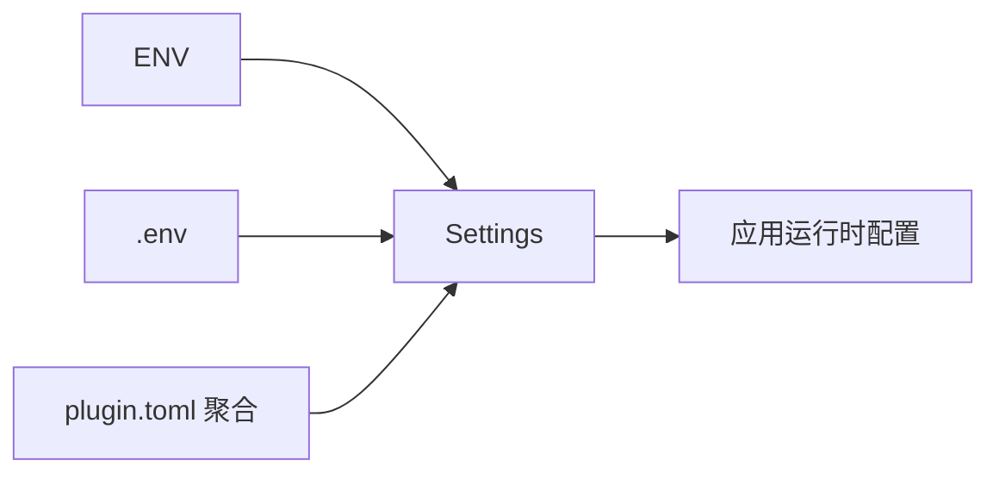
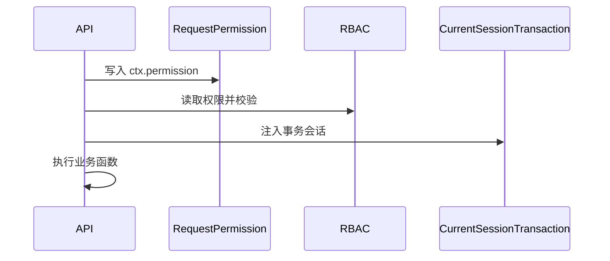

# 4. 配置系统与依赖注入

## 概述

本章目标：理解“配置如何决定系统行为”，以及“依赖注入如何把横切能力装配到 API”。

在这个项目里，配置和依赖注入不是辅助工具，而是工程治理主线：

1. 配置决定运行模式与能力开关。
2. 依赖决定认证、权限、事务边界。

## 配置系统：多源合并

核心在 [backend/core/conf.py](../backend/core/conf.py) 的 Settings：

```python
@classmethod
def settings_customise_sources(...):
    return env_settings, dotenv_settings, PluginSettingsSource(settings_cls)
```

优先级从高到低：

1. 环境变量
2. .env 文件
3. 插件配置源（plugin.toml 聚合）

这套顺序允许你在不改代码的情况下，用环境变量覆盖默认行为。

## 插件配置源如何注入

[backend/plugin/settings_source.py](../backend/plugin/settings_source.py) 会扫描插件目录，读取每个 plugin.toml 的 settings 节。

意义：

1. 插件配置自治，不污染核心配置文件。
2. 核心应用仍通过统一 settings 读取参数。

Mermaid 流程：



## 依赖注入：数据库与事务

在 [backend/database/db.py](../backend/database/db.py) 中定义了两类常用依赖：

```python
CurrentSession = Annotated[AsyncSession, Depends(get_db)]
CurrentSessionTransaction = Annotated[AsyncSession, Depends(get_db_transaction)]
```

区别：

1. CurrentSession：适合查询场景。
2. CurrentSessionTransaction：适合写操作，需要明确事务边界。

## 依赖注入：认证与权限

认证依赖来自 [backend/common/security/jwt.py](../backend/common/security/jwt.py)：

```python
DependsJwtAuth = Depends(HTTPBearer())
```

RBAC 依赖来自 [backend/common/security/rbac.py](../backend/common/security/rbac.py)：

```python
DependsRBAC = Depends(rbac_verify)
```

权限标识依赖来自 [backend/common/security/permission.py](../backend/common/security/permission.py)：

```python
class RequestPermission:
    async def __call__(self, request: Request) -> None:
        ctx.permission = self.value
```

## 为什么 RequestPermission 必须在 RBAC 前

因为 RBAC 校验读取的是 ctx.permission。若先执行 RBAC，再写入权限标识，会出现“无权限标识”的误判。

典型组合：

```python
dependencies=[
  Depends(RequestPermission('sys:user:del')),
  DependsRBAC,
]
```

## 依赖执行时序



## 最佳实践

1. 把“可变策略”放进配置，不要硬编码在 service 中。
2. 把“横切规则”做成依赖，不要散落在每个函数里。
3. 事务依赖只用于写接口，避免无意义长事务。

## 小结

本章你应该掌握：

1. 多源配置如何合并，以及为什么插件配置能无缝接入。
2. FastAPI 依赖如何承载认证、授权、事务。
3. 依赖顺序就是业务语义的一部分。

## 参考文件

- [backend/core/conf.py](../backend/core/conf.py)
- [backend/plugin/settings_source.py](../backend/plugin/settings_source.py)
- [backend/database/db.py](../backend/database/db.py)
- [backend/common/security/jwt.py](../backend/common/security/jwt.py)
- [backend/common/security/rbac.py](../backend/common/security/rbac.py)
- [backend/common/security/permission.py](../backend/common/security/permission.py)
