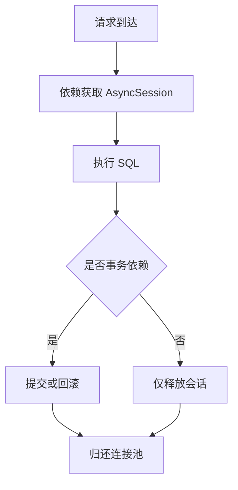

# 5. 数据库层架构（上）：异步引擎与连接管理

## 概述

本章关注数据库“运行时基础设施”：URL 构建、异步引擎、连接池、会话工厂。

核心文件是 [backend/database/db.py](../backend/database/db.py)。

## 数据库 URL 构建

项目支持 MySQL 与 PostgreSQL，通过配置动态构建 URL。你不需要在业务代码中关心驱动差异。

这体现了一个工程原则：把环境差异收敛到基础设施层。

## 异步引擎与连接池

完整代码（`backend/database/db.py`）：

```python
create_async_engine(
    url,
    echo=settings.DATABASE_ECHO,        # 是否打印 SQL 语句（开发调试用）
    echo_pool=settings.DATABASE_POOL_ECHO,
    future=True,                         # 使用 SQLAlchemy 2.0 风格 API
    # ---- 中等并发参考配置 ----
    pool_size=10,        # 常驻连接数（低并发可减小，高并发可增大）
    max_overflow=20,     # 高峰可临时扩展的连接数（峰值上限 = pool_size + max_overflow = 30）
    pool_timeout=30,     # 获取连接超时（秒）：低并发可减小以快速暴露问题
    pool_recycle=3600,   # 连接回收间隔（秒）：MySQL 默认 8h 断开，需小于该值
    pool_pre_ping=True,  # 借出前 SELECT 1 检测连接存活（有额外开销，生产建议 True）
    pool_use_lifo=False, # False = FIFO（高并发建议 True，减少空闲连接数）
)
```

参数解读与调优思路：

| 参数 | 默认值 | 作用 | 调优方向 |
|---|---|---|---|
| `pool_size` | 10 | 常驻连接数 | 压测后按 QPS / 平均 SQL 耗时 估算 |
| `max_overflow` | 20 | 峰值溢出连接数 | 设为 `pool_size` 的 1-2 倍，避免突发流量耗尽连接 |
| `pool_timeout` | 30s | 等待连接超时 | 越小越早暴露连接池不足问题 |
| `pool_recycle` | 3600s | 连接存活上限 | MySQL `wait_timeout`（默认 28800s）的一半以内 |
| `pool_pre_ping` | True | 借出前连通性检测 | 稳定网络环境可设 False 减少延迟 |
| `pool_use_lifo` | False | 后进先出复用连接 | True 可减少空闲连接数，但分布不均时慎用 |

> **连接池容量公式**（简化）：`pool_size ≈ 并发请求数 × 平均 SQL 占用时间(s) / 请求平均耗时(s)`。对于中等并发（< 1000 QPS）场景，`pool_size=10, max_overflow=20` 通常足够。

会话工厂额外参数（`async_sessionmaker`）：

```python
async_sessionmaker(
    bind=engine,
    class_=AsyncSession,
    autoflush=False,         # 禁用自动 flush：避免在事务中意外触发 SQL
    expire_on_commit=False,  # 禁用提交后对象过期：避免事务结束后访问属性触发额外查询
)
```

## 会话工厂与依赖

项目通过 async_sessionmaker 构建会话工厂，再暴露依赖给 API。

```python
async def get_db():
    async with async_db_session() as session:
        yield session

async def get_db_transaction():
    async with async_db_session.begin() as session:
        yield session
```

其中 begin 版本更适合写请求，便于一致性管理。

## 连接生命周期



## 与启动阶段的关系

在第 2 章我们看到 register_init 会调用 create_tables。它依赖 db.py 的引擎配置，因此数据库基础设施必须先稳定，业务模块才可启动。

## 常见坑

1. 把查询接口也放进长事务，导致连接占用过久。
2. 忽略 pool_recycle，在 MySQL 长连接场景下容易遇到断链。
3. 在 service 中手工管理连接，破坏统一依赖入口。

## 小结

你应掌握：

1. 异步引擎是性能与稳定性的底层保障。
2. 连接池参数不是“默认即可”，应按并发模型调优。
3. 会话依赖是数据库访问的唯一入口，不应绕过。

## 参考文件

- [backend/database/db.py](../backend/database/db.py)
- [backend/core/conf.py](../backend/core/conf.py)
