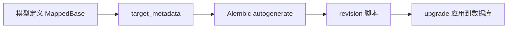

# 6. 数据库层架构（下）：模型设计与 Alembic 迁移

## 概述

本章从“结构定义”角度理解数据库层：

1. 模型基类如何统一字段与行为。
2. 主键策略如何在项目级切换。
3. Alembic 如何与 SQLAlchemy 元数据绑定。

## 模型基类体系

核心在 [backend/common/model.py](../backend/common/model.py)。

项目通过 Base + Mixins 统一常见字段（如时间戳）与数据类行为。

优点：

1. 降低重复定义。
2. 保持各业务模型风格一致。

## 主键策略：自增 vs 雪花

id_key 根据 settings.DATABASE_PK_MODE 动态选择策略：

1. autoincrement：传统数据库自增。
2. snowflake：分布式主键。

关键代码模式（简化）：

```python
id_key = Annotated[int, mapped_column(... default=snowflake.generate ...)]
```

雪花实现见 [backend/utils/snowflake.py](../backend/utils/snowflake.py)，支持 Redis 节点分配与心跳续租。

## 时间字段与时区

时区工具位于 [backend/utils/timezone.py](../backend/utils/timezone.py)。模型中通过 TimeZone 类型和 default_factory 统一时间行为，避免各模块自定义时间处理导致不一致。

## Alembic 集成

迁移入口是 [backend/alembic/env.py](../backend/alembic/env.py)：

```python
target_metadata = MappedBase.metadata
```

这让 Alembic 能感知项目中所有模型元数据。

在线迁移流程（简化）：

1. 读取 settings 组装数据库 URL。
2. 创建异步引擎。
3. 在连接中执行 context.run_migrations。

Mermaid：



## 迁移策略建议

1. 开发期可使用 autogenerate 提升效率。
2. 上线前必须人工审查 migration 脚本。
3. 避免在业务峰值时执行高风险结构变更。

## 小结

你应掌握：

1. model.py 是全局模型规范入口。
2. 主键策略是项目级能力，而非单模型技巧。
3. Alembic 的核心不是命令，而是 metadata 与运行上下文。

## 参考文件

- [backend/common/model.py](../backend/common/model.py)
- [backend/utils/snowflake.py](../backend/utils/snowflake.py)
- [backend/utils/timezone.py](../backend/utils/timezone.py)
- [backend/alembic/env.py](../backend/alembic/env.py)
