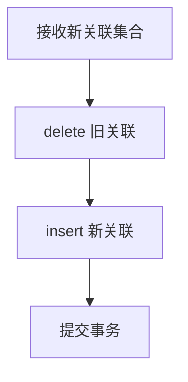

# 7. CRUD 封装与查询构建器

## 概述

本章目标：理解项目为何不在 service 里直接写 SQL，而是通过 CRUD 层统一封装数据访问。

典型案例来自 [backend/app/admin/crud/crud_user.py](../backend/app/admin/crud/crud_user.py) 和 [backend/app/admin/crud/crud_role.py](../backend/app/admin/crud/crud_role.py)。

## CRUDPlus 的价值

项目使用 sqlalchemy-crud-plus 的 CRUDPlus 与 JoinConfig，把复杂查询变成可复用的声明式组合。

好处：

1. Service 不再关注 SQL 细节。
2. 关联查询可标准化复用。
3. 过滤条件拼装更统一。

## 动态过滤与排序

用户列表查询（简化）：

```python
filters = {}
if username:
    filters['username__like'] = f'%{username}%'

return await self.select_order('id', 'desc', join_conditions=[...], **filters)
```

这类 `__like`、`__in` 风格过滤让“参数到查询”映射更清晰。

## JoinConfig 关联查询

核心思想：把 join 条件声明在一个列表中，而不是散落在 SQL 片段。

`JoinConfig` 完整字段说明：

| 字段 | 类型 | 说明 |
|---|---|---|
| `model` | ORM 模型 / 关联表 | 要 JOIN 的目标模型，可以是 ORM 类或多对多中间表（`Table` 对象） |
| `join_on` | SQL 表达式 | JOIN 条件（等同于 `ON` 子句） |
| `join_type` | `str` | JOIN 类型，默认 `'left'`，可选 `'inner'`、`'right'`、`'full'` |
| `fill_result` | `bool` | `True` 时将关联模型字段合并到查询结果；`False` 时仅用于过滤条件 |
| `alias` | ORM 别名 | 同一张表多次 JOIN 时需指定别名（`aliased(Model)`）防止字段冲突 |

用户列表查询的完整 `JoinConfig` 示例（`crud_user.py`）：

```python
return await self.select_order(
    'id',
    'desc',
    join_conditions=[
        # 关联部门表（fill_result=True：将 dept 字段合并到结果）
        JoinConfig(model=Dept, join_on=Dept.id == self.model.dept_id, fill_result=True),
        # 关联用户角色中间表（fill_result=False：仅用于过渡 JOIN，不填充字段）
        JoinConfig(model=user_role, join_on=user_role.c.user_id == self.model.id),
        # 关联角色表（fill_result=True：将 role 字段合并到结果）
        JoinConfig(model=Role, join_on=Role.id == user_role.c.role_id, fill_result=True),
    ],
    **filters,  # 动态过滤条件（username__like / dept_id / status 等）
)
```

> **注意**：多对多关联需要两步 JOIN（先关联中间表，再关联目标表），中间表的 `JoinConfig` 通常 `fill_result=False`。

### N+1 问题与预防

**N+1 问题**：查询列表时，如果对每条记录再单独发起关联查询，会产生 `1 + N` 次 SQL，是 ORM 使用中最常见的性能陷阱。

**项目中的预防方式**：使用 `JoinConfig` 一次性 JOIN 所有关联表，而非在 Python 代码中循环访问关联属性。

```python
# ❌ 错误示范：会触发 N+1（每次访问 user.dept 都发出一条 SQL）
users = await crud.select_models(db)
for user in users:
    dept_name = user.dept.name  # 惰性加载，每次额外发 SQL

# ✅ 正确方式：用 JoinConfig 一次 JOIN，或配置 selectinload
JoinConfig(model=Dept, join_on=Dept.id == self.model.dept_id, fill_result=True)
```

对于需要加载深层关联（如 `role.menus`）的场景，SQLAlchemy 提供了两种预加载策略：

```python
from sqlalchemy.orm import selectinload, joinedload

# selectinload：额外发一条 IN 查询，适合一对多/多对多（推荐）
select(User).options(selectinload(User.roles).selectinload(Role.menus))

# joinedload：在同一 SQL 中 JOIN，适合多对一（如 user.dept），数据量大时慎用
select(User).options(joinedload(User.dept))
```

## 多对多更新套路：先删后插

角色菜单更新、角色数据范围更新普遍采用：

1. 删除旧关联。
2. 批量插入新关联。

这种方式在“全量覆盖更新”场景下可读性高、行为确定性强。

Mermaid：



## 聚合读取：get_join

CRUDUser.get_join 是一个典型“聚合读取”实现：一次查询关联部门、角色、菜单、数据范围等信息，供登录态与权限计算使用。

这类函数适合放在 CRUD 层，而不是 API 层。

## 最佳实践

1. CRUD 层负责数据访问，不做业务策略判断。
2. Service 层负责规则组合与异常语义。
3. 复杂查询统一命名（如 get_select/get_join），便于团队协作。

## 小结

你应掌握：

1. CRUD 封装是分层治理，而不是“多写一层”。
2. JoinConfig 让关联查询更可维护。
3. 先删后插是多对多全量更新的稳定范式。

## 参考文件

- [backend/app/admin/crud/crud_user.py](../backend/app/admin/crud/crud_user.py)
- [backend/app/admin/crud/crud_role.py](../backend/app/admin/crud/crud_role.py)
- [backend/app/admin/service/user_service.py](../backend/app/admin/service/user_service.py)
