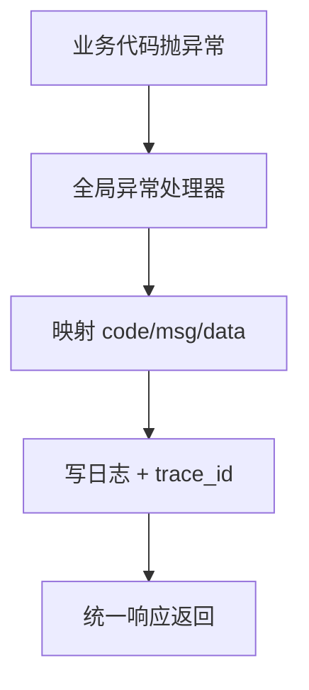

# 8. 统一响应与异常处理

## 概述

本章解释两个工程化关键点：

1. 为什么所有接口要统一响应结构。
2. 为什么异常必须在全局统一收敛。

## 统一响应模型

核心在 [backend/common/response/response_schema.py](../backend/common/response/response_schema.py)。

标准结构：

1. code：业务状态码。
2. msg：可国际化消息。
3. data：业务数据。

这个结构的价值：

1. 前端处理逻辑稳定。
2. 日志/监控可统一解析。
3. 团队接口风格一致。

## ResponseBase 作为统一出口

常用方法：

1. success：标准成功返回。
2. fail：标准失败返回。
3. fast_success：高性能返回（需谨慎）。

## 异常体系

异常定义位于 [backend/common/exception/errors.py](../backend/common/exception/errors.py)。

特点：

1. 业务异常类型细分（认证、授权、冲突、未找到等）。
2. 每类异常携带可落地到响应层的 code/msg。

## 全局异常处理

注册在 [backend/common/exception/exception_handler.py](../backend/common/exception/exception_handler.py)，由 registrar 装配。

处理流程：

1. 捕获异常。
2. 映射为统一响应结构。
3. 附带 trace_id 与日志记录。

Mermaid：

## 与国际化联动

项目的错误消息可通过 i18n 翻译，实现多语言一致行为。这样异常消息不再是硬编码中文字符串。

## 最佳实践

1. Service 抛“语义明确”的业务异常，不直接拼响应。
2. API 层只做响应包装，不做异常吞并。
3. 禁止“裸 Exception”直接暴露到用户。

## 小结

统一响应 + 全局异常处理，是接口规范化与可维护性的底座。

## 参考文件

- [backend/common/response/response_schema.py](../backend/common/response/response_schema.py)
- [backend/common/response/response_code.py](../backend/common/response/response_code.py)
- [backend/common/exception/errors.py](../backend/common/exception/errors.py)
- [backend/common/exception/exception_handler.py](../backend/common/exception/exception_handler.py)
