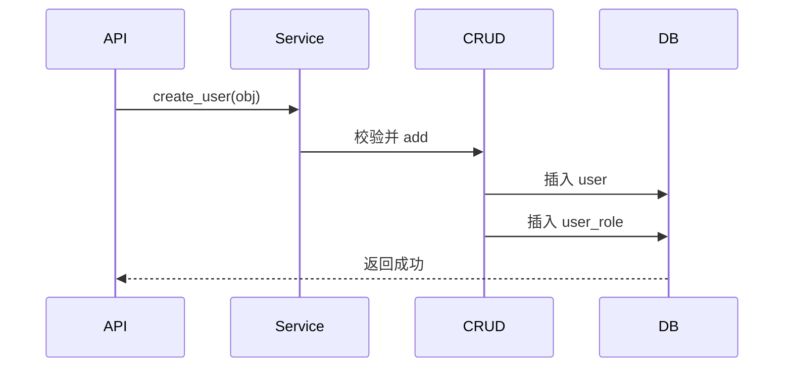

# 9. Admin 模块深度解析（上）：用户与角色管理

## 概述

本章以用户管理为主线，展示一条完整业务链路如何穿过 API、Service、CRUD、Model。

## 用户域模型

关键模型在 [backend/app/admin/model/user.py](../backend/app/admin/model/user.py)。

重点字段：

1. username / password / salt：认证基础。
2. status / is_superuser / is_staff：账号能力控制。
3. dept_id：组织归属。
4. is_multi_login：多端登录控制。

## 用户创建流程

核心逻辑在 [backend/app/admin/service/user_service.py](../backend/app/admin/service/user_service.py) 的 create。

主要步骤：

1. 校验用户名是否重复。
2. 校验部门与角色存在性。
3. 调用 user_dao.add 执行写入。

DAO 层在 [backend/app/admin/crud/crud_user.py](../backend/app/admin/crud/crud_user.py) 中完成密码加密与角色关系写入。

Mermaid：

## 用户更新与缓存失效

用户信息更新后，Service 会删除 JWT 用户缓存键，确保后续读取不拿旧数据。

这体现了业务层的重要职责：

1. 不只写数据库。
2. 还要维护读侧一致性。

## 用户权限变更

update_permission 是高价值案例：

1. 区分修改自己/修改他人。
2. 区分不同权限类型（superuser/staff/status/multi_login）。
3. 需要联动 token 失效范围。

## 角色管理联动

角色模型与用户通过多对多关联。用户读取时通过 join 一次性拿到角色集合。

角色侧核心在 [backend/app/admin/crud/crud_role.py](../backend/app/admin/crud/crud_role.py) 与对应 service：

1. 角色基础信息。
2. 角色菜单关联。
3. 角色数据范围关联。

## 最佳实践

1. 账号与权限变更必须同时考虑缓存和 token。
2. 写操作使用事务依赖，保证 user 与 user_role 一致性。
3. 用户模块的规则尽量集中在 UserService，避免散落。

## 小结

用户与角色不是孤立 CRUD，而是“身份 + 授权 + 会话状态”三位一体。

## 参考文件

- [backend/app/admin/api/v1/sys/user.py](../backend/app/admin/api/v1/sys/user.py)
- [backend/app/admin/service/user_service.py](../backend/app/admin/service/user_service.py)
- [backend/app/admin/crud/crud_user.py](../backend/app/admin/crud/crud_user.py)
- [backend/app/admin/model/user.py](../backend/app/admin/model/user.py)
- [backend/app/admin/crud/crud_role.py](../backend/app/admin/crud/crud_role.py)
